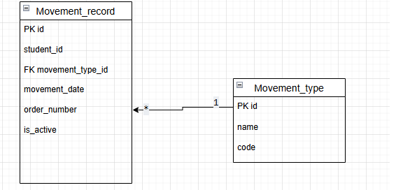

### Вариант 9. Student Movement Service (Сервис движения студентов)

## API Endpoints

| Метод | Endpoint | Описание |
|-------|----------|----------|
| POST | `/movements` | Создать запись о движении |
| GET | `/movements/{id}` | Получить запись по ID |
| PUT | `/movements/{id}` | Обновить запись |
| DELETE | `/movements/{id}` | Мягкое удаление |
| GET | `/movements?student_id={id}` | Список по студенту |

## Сущность: MovementRecord

### 1. Информация для создания

| Параметр | Пояснение | Обязательность | Тип | Ограничение | Значение по умолчанию |
|-----------|-----------|----------------|-----|-------------|----------------------|
| student_id | ID студента | Да | int | >0 | — |
| movement_type_id | ID типа движения | Да | int | существует в MovementType | — |
| movement_date | дата движения | Да | date | не в будущем | — |
| order_number | номер приказа | Да | str | 1-50 символов | — |

### 2. Уникальные комбинации

- `(student_id, movement_date, movement_type_id)`

### 3. Возврат при создании

| Параметр | Тип |
|-----------|-----|
| id | int |
| student_id | int |
| movement_type_id | int |
| movement_date | date |
| order_number | str |
| is_active | bool |

### 4. Изменение по ID

| Параметр | Пояснение | Обязательность | Тип | Ограничение |
|-----------|-----------|----------------|-----|-------------|
| movement_type_id | тип движения | Нет | int | >0 |
| movement_date | дата движения | Нет | date | не в будущем |
| order_number | номер приказа | Нет | str | 1-50 символов |

### 5. Возврат при изменении

| Параметр | Тип |
|-----------|-----|
| id | int |
| student_id | int |
| movement_type_id | int |
| movement_date | date |
| order_number | str |
| is_active | bool |

### 6. Удаление

Мягкое удаление: `is_active = False`. Возвращает `True` или `False`.

### 7. Получение по ID

| Параметр | Пояснение | Тип |
|-----------|-----------|-----|
| id | ID записи | int |
| student_id | ID студента | int |
| movement_type_id | тип движения | int |
| movement_date | дата движения | date |
| order_number | номер приказа | str |
| is_active | активна ли запись | bool |

### 8. Параметры для списка

| Параметр | Пояснение | Тип |
|-----------|-----------|-----|
| student_id | фильтр по студенту | int |
| movement_date_from | дата от | date |
| movement_date_to | дата до | date |
| limit | лимит | int |
| offset | смещение | int |

### 9. Возврат списка

| Параметр | Тип |
|-----------|-----|
| id | int |
| student_id | int |
| movement_type_id | int |
| movement_date | date |
| order_number | str |
| is_active | bool |

## Список функций

1. `init_db()`
2. `create_movement()`
3. `get_movement_by_id()`
4. `update_movement()`
5. `delete_movement()`
6. `get_movements_by_student()`

## ER-диаграмма

